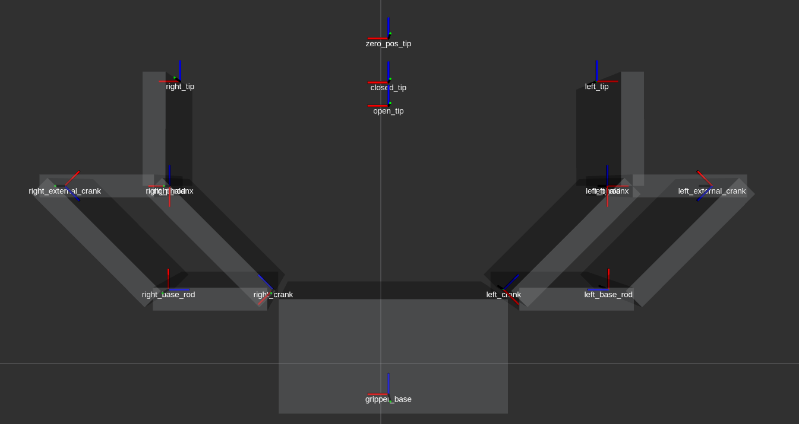
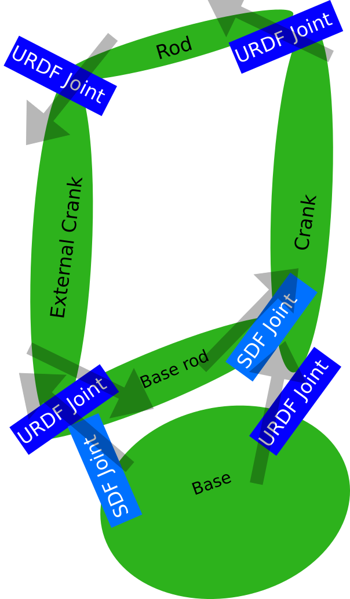

# parallel 2-Fingers gripper

Gazebo model of a 2-Fingers gripper with closed-chain fingers. The movements of the two fingers are synchronized.

## Gripper kinematics
The gripper has two fingers with a four-bars kinematic.


### Finger kinematics

The finger kinematics in URDF is modeled with mimic_joint, while the SDF format (obtained by URDF add <gazebo></gazebo> tags) uses the closed-chain structure
.

The phalanx is fixed to the (moving) rod.

*Note:* The base rod has to be a link with non-null inertia is necessary to avoid model reduction.

### Finger synchronization
In the URDF file the fingers are synchronized using mimic_joint. The SDF file use a *gearbox* joint:
```xml
<gazebo>
  <!-- gearbox between the two finger (like mimic for URDF) -->
  <joint name="${prefix}left_right" type="gearbox">
   <parent>${prefix}right_crank</parent>
   <child>${prefix}left_crank</child>

   <!-- movements are computed between:
   - parent and gearbox_reference_body
   - child and gearbox_reference_body
   -->
   <gearbox_reference_body>${prefix}gripper_base</gearbox_reference_body>
   <!-- the movement has already a negative sign -->
   <gearbox_ratio>1</gearbox_ratio>
   <!-- pose does not care -->
   <pose relative_to="gripper_base">0 0 0 0 0 0</pose>
   <axis>
     <xyz>0 1 0</xyz>
   </axis>
 </joint>
</gazebo>
```

## Gripper ROS Control
Gazebo exposes right_finger_joint (hardware_interface/EffortJointInterface). Gazebo splits the torque between joints automatically thanks to the gearbox.

In the example below, the used controller is a [robot_control/MimicEffortController](https://github.com/JRL-CARI-CNR-UNIBS/standard_ros_control_library/tree/master/mimic_controller), with only one joint in other to be able to set the grasping torque with a JointState message

(TDB: use a controller with less dependecies required)

## Gripper controller
The node gripper_server (type gripper_server.py) creates a [Job execution service](https://github.com/JRL-CARI-CNR-UNIBS/manipulation/blob/master/manipulation_msgs/srv/JobExecution.srv) to open (property_id="open") and close the gripper (property_id="close")

## Stand-alone test

To test the gripper you can launch:
```
roslaunch parallel_2f_gripper gazebo_standalone.launch
```
which load the gripper and a Coke can in gazebo.

The node gripper_server (type gripper_server.py) creates a [Job execution service](https://github.com/JRL-CARI-CNR-UNIBS/manipulation/blob/master/manipulation_msgs/srv/JobExecution.srv) to open (property_id="open") and close the gripper (property_id="close")

The node gripper_test (type test_open_close.py) open and close the gripper periodically.
